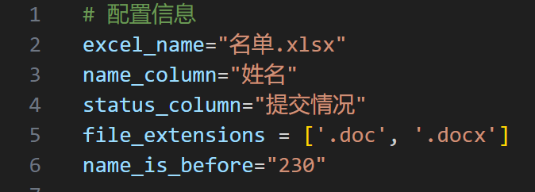
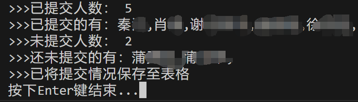

# Job-submission-status-Check-tool


  


  

此文档的语言为简体中文，仅针对中文用户。For English? [Please click here](README_en-US.md).

## 目录

- [更新日志](#更新日志)
- [分支](#分支)
- [准备工作](#准备工作)
- [运行](#运行)
- [写到最后](#写到最后)
- [协议](#协议)

## 引言与简介

无论你是大学生还是老师，你都可能为收作业时登记作业上交情况而感到头疼。你会因为一些机械性工作而感到头疼。现在，你可以使用这个程序来大幅度减轻工作量。

本软件可以一键检查文件提交情况，统计已提交/未提交人以及人数，并登记到Excel表格当中。

## 更新日志

### v2.0

- [x] 不依赖于姓名分隔符，提高对于文件命名规范的宽容度，避免了统计遗漏
- [x] 自动检查配置信息是否有效，帮助用户排错

### v1.x

- [x] 基本实现准确地核对表格中的文件提交情况
- [x] 能在终端中列出已交/未交人员人数/名单
- [x] 能将结果保存至原表格中
- [x] 能检查是否因文件命名不规范而可能导致的遗漏

- [ ] 识别名字依赖于分隔符，对于文件命名格式要求严格。若不慎加入空格等其他字符，可能导致识别出错
- [ ] 出错后用户不易排查，程序直接退出

## 分支

- main:目前最新发布版本的代码
- v1：已停止维护的第一版
- v2：最新开发版本
- ltp-name：尝试使用ltp模型进行提取姓名，因速度慢、准确率低、技术复杂化而被弃用


## 准备工作

### 环境与软件包

确保你安装了较新版本的 Python3 环境，并安装以下软件包：

```bash
pip install pandas
pip install openpyxl
pip install keyboard
```

### 准备文件

1. 同学们提交的所有作业文件；
2. 含有所有名字的名单表格；
3. 该程序 'main.py' 文件；

如果你没有下载该程序，可以通过以下命令下载，并将其中的 'main.py' 文件移到与以上两个文件相同目录下：

```bash
git clone https://github.com/Gloridust/Job-submission-status-Check-tool.git
```

### 配置文件

在 'main.py' 文件的头部你可以看见这样的配置信息：



注意将以下变量内容替换为你实际的信息：

    'excel_name' 为你提供的名单表格的相对路径；
    'name_column' 为名单表格中所有人名字所在列的表头；
    'status_column' 为输出结果列的表头；
    'file_extensions' 为所有需要被统计的文件名后缀；
    'name_is_before' 为名字在哪个字符串前：例如果你的文件名为 '张三2301101024' ,姓名为 '230' 前面的所有字符串，则填 '230' ；

## 运行

双击或在文件目录下使用以下命令运行：

```bash
python3 ./main.py
```

按照提示操作后，可以看到统计结果。结果会输出到终端，并保存登记情况到表格中。




## 写到最后

至此，你应该已经可以体验到该项目的便利之处了。如果你喜欢，可以为我点一个 star 以表支持。十分感谢！

    愿中国青年都摆脱冷气，只是向上走，不必听自暴自弃者流的话。能做事的做事，能发声的发声。有一分热，发一分光，就令萤火一般，也可以在黑暗里发一点光，不必等候炬火。

    此后如竟没有炬火：我便是唯一的光。倘若有了炬火，出了太阳，我们自然心悦诚服的消失。不但毫无不平，而且还要随喜赞美这炬火或太阳；因为他照了人类，连我都在内。

## 协议

Mozilla