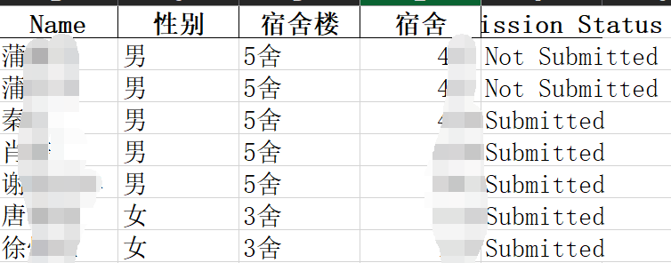

# Job Submission Status Check Tool


  


  

This document is in English. For Chinese? [Please click here](README.md).

## 目录

- [Changelog](#changelog)
- [Branches](#branches)
- [Preparation](#preparation)
- [Run](#run)
- [Conclusion](#conclusion)
- [LICENCE](#licence)

## Preface and Introduction

Whether you are a university student or a teacher, you might have experienced the headache of logging homework submission statuses. Now, you can use this program to significantly reduce your workload.

This software allows you to check homework submission statuses at the click of a button, tallying submitted/unsubmitted individuals and their numbers, and logging them into an Excel spreadsheet.

## Changelog

### v2.0

- [x] Removed dependency on name delimiters, increasing tolerance for file naming conventions and avoiding statistical omissions.
- [x] Automatically checks the validity of configuration information to assist users in troubleshooting.

### v1.x

- [x] Successfully implemented accurate verification of file submission status in the spreadsheet.
- [x] Able to list the number/names of individuals who have submitted/not submitted in the terminal.
- [x] Capable of saving results back to the original spreadsheet.
- [x] Can check for potential omissions due to improper file naming.

- [ ] Name recognition relies on delimiters, making it strict in file naming conventions. Accidentally adding spaces or other characters may lead to recognition errors.
- [ ] Difficult for users to troubleshoot after errors occur as the program exits directly.

## Branches

- main: Code for the currently latest released version.
- v1: First version, no longer maintained.
- v2: Latest development version.
- ltp-name: Attempted to use the LTP model for extracting names, but abandoned due to slow speed, low accuracy, and technical complexity.

## Preparation

### Environment and Packages

Make sure you have a recent version of Python3 installed, along with the following packages:

```bash
pip install pandas
pip install openpyxl
pip install keyboard
```

### Required Files

1. All homework files submitted by students;
2. A list spreadsheet containing all names;
3. The 'main_en-US.py' file of this program;

If you haven't downloaded the program yet, you can download it with the following command and move the 'main_en-US.py' file to the same directory as the two files mentioned above:

```bash
git clone https://github.com/Gloridust/Job-submission-status-Check-tool.git
```

### Configuration

At the beginning of the 'main_en-US.py' file, you can see configuration information like this:


Be sure to replace the following variable contents with your actual information:

    'excel_name' as the relative path to your provided list spreadsheet;
    'name_column' as the header of the column where all names are located in the list spreadsheet;
    'status_column' as the header of the output results column;
    'file_extensions' as all file name extensions to be tallied;
    'name_is_before' as the string before which the name part is: for example, if your file name is 'Ethan2301101024', and the name is all strings before '230', then fill in '230';

## Run

Double-click or run the following command in the file directory:

```bash
python3 ./main_en-US.py
```

Follow the prompts, and you will see the tally results. Results will be output to the terminal and saved to the spreadsheet.




## Conclusion

By now, you should be able to appreciate the convenience of this project. If you like it, please consider giving it a star to show your support. Thank you very much!

    I hope the youth of China can all free themselves from the cold, and strive only to move forward, not listening to those who have given up on themselves. Let those who can act, act; and those who can speak, speak. If you have a bit of warmth, share a bit of light, just like a firefly, it too can shine a little light in the darkness, no need to wait for a torch.

    If there are no torches in the future: I shall be the only light. If there comes a torch or the sun, we will naturally and gladly vanish. Not with resentment, but with joy and praise for the torch or the sun; because it illuminated humanity, myself included.

## LICENCE

Mozilla